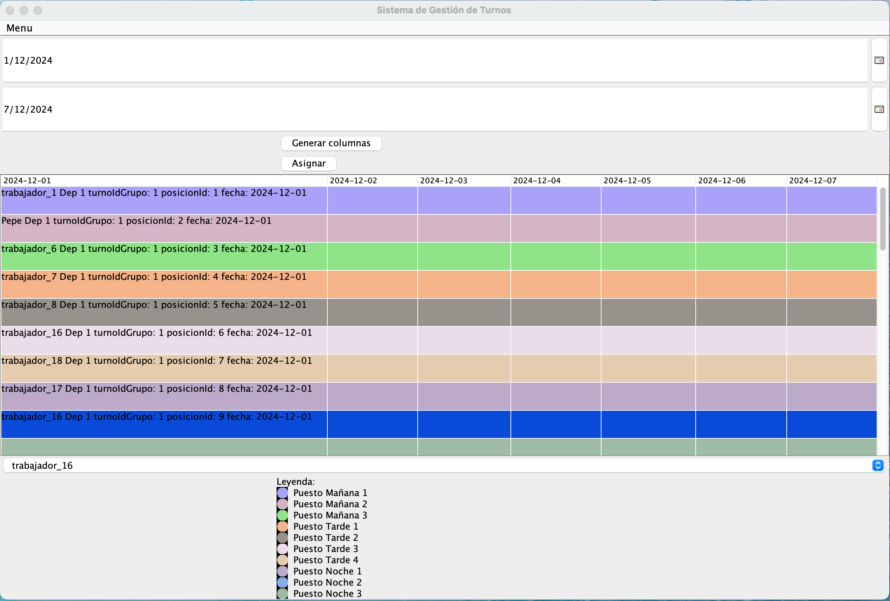

# Proyecto Turnos

## Descripción

>***Aplicación en Java utilizando [Swing](https://docs.oracle.com/javase/tutorial/uiswing/) para organizar los turnos y posiciones de los trabajadores.*** La aplicación permitirá gestionar turnos, administrar ausencias, establecer restricciones generales como la limitación de horas de trabajo, asignar automáticamente los turnos y generar alertas cuando no se puedan ocupar puestos.



### Funcionalidades Principales
- **Gestión de Turnos**: Permitir al administrador gestionar los turnos de los trabajadores de cada departamento.
- **Administración de Ausencias**: Considerar las ausencias por vacaciones o enfermedades al asignar los turnos.
- **Restricciones Generales**: Establecer restricciones como un máximo de x horas semanales por trabajador.
- **Asignación Automática**: Asignar turnos automáticamente respetando las ausencias y restricciones.
- **Generación de Alertas**: Notificar problemas como la falta de trabajadores para cubrir los puestos necesarios.


### Comandos Maven para Proyectos Java
Para compilar y ejecutar el proyecto:
```bash
mvn clean install  # Compila el proyecto y descarga las dependencias
mvn exec:java -Dexec.mainClass="com.turnos.TurnosMain.java"  # Ejecuta la aplicación principal
```
## Credits Gestor-Turnos
- [Antonela Díaz](https://github.com/antoneladg91)
- [Sergio Domínguez](https://github.com/DISTRONYX)
- [Juan José Romero](https://github.com/juanjo2gm)
- [Felipe Marín](http://github.com/flpmarin)


